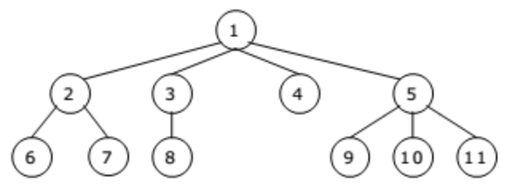
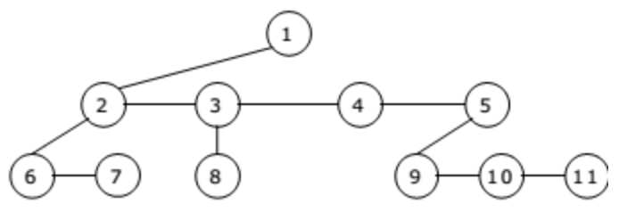

# P1 - Problem Statement
Create a generic tree with following structure and data.

## [S1](https://github.com/Lakshitnagar/DS-ALGO/blob/master/ds/genericTree/p1/S1.java) - Solution 1
Our solution should look like this

1. Create a generic tree using manual steps.

### Complexity

|               | Insertion     |
| ------------- | ------------- |
| Time          | O(n)          |
| Space         | O(1)          |
